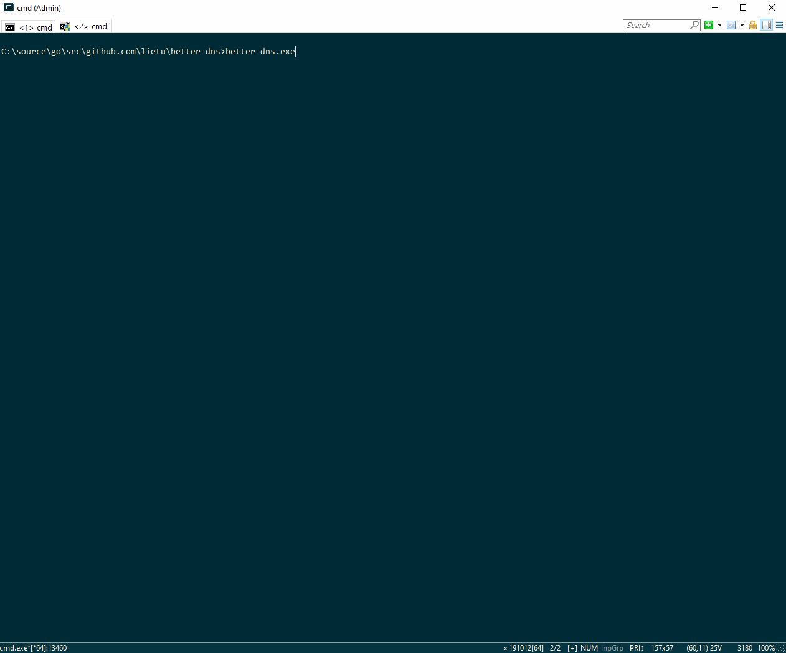

[](https://travis-ci.org/lietu/better-dns)
[](https://opensource.org/licenses/BSD-3-Clause)

# Better DNS

Local DNS based ad (etc) blocker, privacy enhancer, and performance optimizer, partially inspired by [Pi-hole](https://pi-hole.net).



What it can do:

 - Supports [DNS over TLS](https://en.wikipedia.org/wiki/DNS_over_TLS) and [DNS over HTTPS](https://en.wikipedia.org/wiki/DNS_over_HTTPS) (using the DNS UDP wire protocol) servers with e.g. [Cloudflare](https://developers.cloudflare.com/1.1.1.1/dns-over-https/) to avoid snooping, as well as plain old insecure DNS (but why would you want to use it?)
 - Run locally, no need to host servers of any kind, but you can also run it on a server
 - Protect you in every network you're connected to
 - Block (many) ads (and other unwanted things) in pretty much all programs you use (unless they use some custom DNS setup, which is not very common)
 - Parse common block lists from HTTP(S) urls (`/etc/hosts` format, and one host per line)
 - Support a custom blacklist as well with `*` wildcard support
 - Block A & AAAA record resolution of addresses on those lists
 - Performs DNS requests to multiple servers in parallel and returns fastest successful response
 - Proxy any non-blacklisted DNS requests to a proper DNS server
 - Caches results (minimum 30s, otherwise respects TTL in responses, using a fixed-size LRU) - leads to a minor performance enhancement in some scenarios
 - Override your active DNS servers while it's running and return them to normal on exit
 - Show all the DNS requests your software is doing - maybe you'll find it enlightening
 - Supports Windows, Mac, and Linux (at least based on limited testing)

Current version is quite preliminary still, however it seems to very much work (on Windows 10, Mac OS High Sierra, and Fedora 31 armhfp on Raspberry Pi 2).

You probably have to run it as Administrator/root so it has enough permissions to edit your DNS server configuration and listen to port 53 TCP & UDP, as these are privileged service ports.


## Configuration

The [.better-dns.yaml](./.better-dns.yaml) has an example configuration. It's expected to be found at `~/.better-dns.yaml` or `%USERPROFILE%\.better-dns.yaml`, or in a file defined by `-config <path>` -argument to `better-dns`.

*DNS Servers*

By default `better-dns` uses one Cloudflare server with DNS over HTTPS, and one with DNS over TLS, but you may want to customize the servers. Entries should be URIs, with `https://ip/url`, `dns+tls://ip`, or `dns://ip` -format, e.g.:

```yaml
dns_servers:
  - https://1.1.1.1/dns-query
  - dns+tls://1.0.0.1
  - dns://192.168.1.1
```
*Block lists*

There are a number of [default blocklists](./shared/config.go) defined that should be a good basis to start from. If you want to choose your own lists to use, you can define them in a simple list of URLs to use.

Files in the `/etc/hosts` format, as well as simple lists of one host per line, are supported. Lines starting with `#` are ignored.

```yaml
block_lists:
 - https://raw.githubusercontent.com/StevenBlack/hosts/master/hosts
 - https://mirror1.malwaredomains.com/files/justdomains
 - http://sysctl.org/cameleon/hosts
 - https://s3.amazonaws.com/lists.disconnect.me/simple_tracking.txt
 - https://s3.amazonaws.com/lists.disconnect.me/simple_ad.txt
 - https://hosts-file.net/ad_servers.txt
 - https://pgl.yoyo.org/adservers/serverlist.php?hostformat=hosts&showintro=0&mimetype=plaintext
```

*Blacklist*

In case you want to add custom entries to block, with simple `*` wildcard support, that's also supported. The default is to block `wpad.*` requests ([Web Proxy Auto-Discovery Protocol](https://en.wikipedia.org/wiki/Web_Proxy_Auto-Discovery_Protocol)) for a minor speedup, but you can remove that or add various entries like this:

```yaml
blacklist: []
# OR
blacklist:
 - my.blacklist.domain
 - "*.wildcard.domain"
 - "prefix.*"
```

*Listen address*

By default `better-dns` only listens to `127.0.0.1`, but if you want to listen to other interfaces you can set it to listen to a specific interface IP or `0.0.0.0` for all interfaces:

```yaml
listen_host: 0.0.0.0
```


## Future ideas

 - Running as a service
 - Installers or similar
 - Support for more OSes (should be pretty easy to add, would like to see BSDs at least supported in the near future, and specifically router software like pfSense supported)
 - Cached block lists in case your network isn't working perfectly when you launch the software
 - Periodically checking the lists for updates (e.g. hourly / daily)
 - Monitor for new networks (e.g. WiFi) and update their DNS settings as well
 - Reporting interface similar to Pi-hole


# License

Short answer: This software is licensed with the BSD 3-clause -license.

Long answer: The license for this software is in [LICENSE.md](./LICENSE.md), the libraries used may have varying other licenses that you need to be separately aware of.
